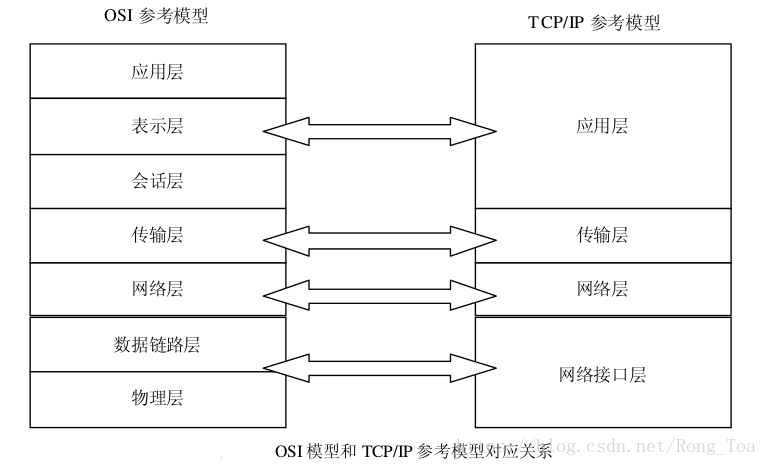
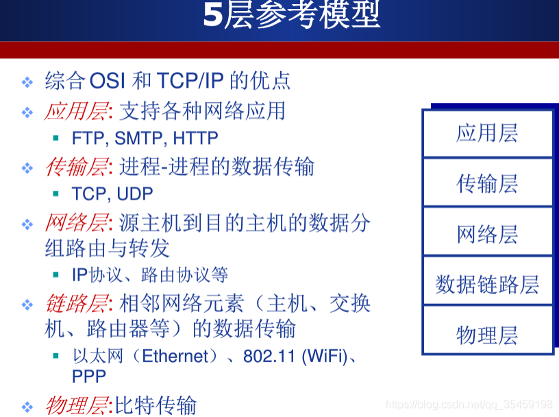

# 计算机网络概述
## 什么是计算机网络？
**计算机网络 = 通信技术 + 计算机技术**

**定义**：计算机网络就是互连的、自治的计算机集合。自治表示无主从关系，互联表示互联互通

## 什么是因特网？
**定义**：因特网是一个世界范围的计算机网络，即它是一个互联了遍及全世界数十亿计算设备的网络。

## 什么是网络协议？
**定义**：网络协议简称为协议，是为进行网络中的数据交换而建立的规则、标准或约定

**协议**规定了通信实体之间所交换的消息的格式、意义、顺序以及针对收到信息或发生的事件所采取的“动作”

**协议的三要素**：语法、语义、时序

## 计算机网络结构
**网络边缘**：主机（端系统）、网络应用

**接入网络**：有线或无线通信线路

**网络核心**：互联的路由器（或分组转发设备）

## OSI参考模型
**共分为如下七层**：

**OSI模型是一种理论下的模型，其中表示层、会话层在实际的计算机网络结构并不单独存在**

## TCP/IP模型
**共分为如下四层**：

应用层：HTTP、DNS等协议，传输层：TCP、UDP协议，网络层：IP协议，而对于网络接口层，TCP/IP模型没有定义特定的协议

## 5层参考模型
是实际中运用最多的网络模型，共分为如下五层：
